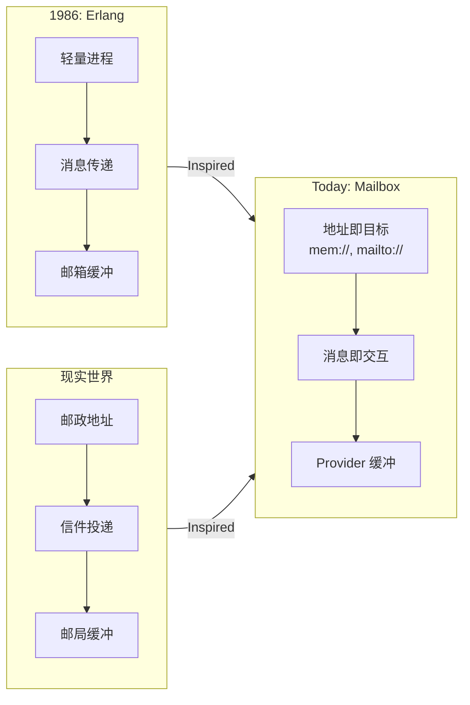

# 📮 Mailbox — 像 Erlang 一样思考异步编程

> 轻量可插拔的“邮箱/队列”内核，把一切通信看作“给某个地址投递一封信”。每个地址背后是一个邮箱（队列），由不同 Provider 适配：mem://（内存）、mailto://（电子邮件）、slack://（聊天）……
> 用邮箱（Mailbox）进行异步通讯，构建容错、分布式、人机协同系统。

[](https://www.npmjs.com/package/@mboxlabs/mailbox)
[](LICENSE)

## 🌟 为什么 Mailbox？

| 传统方式 | Mailbox 方式 |
|----------|--------------|
| ❌ 共享状态 + 锁 | ✅ 独立邮箱 + 消息 |
| ❌ 回调地狱 | ✅ `async/await` 无缝衔接 |
| ❌ 人机协作复杂 | ✅ 人 = 一个邮箱地址 |
| ❌ 离线场景难处理 | ✅ 消息自动缓冲重试 |

### Erlang 灵感

> _🙏 致敬：Erlang 的 Actor 模型_
> _“在 1980 年代，当计算机还像房间一样大时，
> Erlang 的创造者们就提出了一个革命性思想：
> **每个进程有自己的邮箱，通过消息通信，崩溃不是失败而是设计的一部分**”_
> —— Joe Armstrong, Robert Virding, Mike Williams

Mailbox **深受 Erlang Actor 模型启发**，但我们做了关键演进：

| Erlang (1986) | Mailbox (Today) | 为什么重要 |
|---------------|-----------------|------------|
| `Pid ! Message` | `send({ to: 'xxx://address' })` | **地址即协议**：URI 统一标识 + 传输 |
| 进程内 FIFO 邮箱 | Provider 可插拔 | **传输无关**：内存/邮件/Wechat/Mastodon 无缝切换 |
| 同一节点内通信 | 跨网络、跨组织 | **真正分布式**：人类和机器平等参与 |

> 💡 **我们的定位**：
> **不是 Erlang 的 JavaScript 复刻，而是 Actor 思想的现代化表达** ——
> 用 TypeScript 的类型安全 + JavaScript 的生态活力，让“地址即目标”触手可及。

## 🚀 为什么 Mailbox 让人激动？

### 📮 我们解决了什么？

| 传统世界 | Mailbox 世界 |
|----------|--------------|
| ❌ “服务必须在线才能调用” | ✅ **投递即成功** —— 不关心对方状态 |
| ❌ “人类必须实时响应” | ✅ **人类 = 一个地址** —— 按自己节奏处理 |
| ❌ “跨组织协作需要 API 对接” | ✅ **电子邮件就是 API** —— 零集成成本 |
| ❌ “移动端离线 = 功能瘫痪” | ✅ **离线是常态** —— 消息自动缓冲等待 |

### 💡 灵感融合：Erlang 智慧 + 现实世界

> _“Erlang 教会我们：**消息传递是构建健壮系统的基石**
> 现实世界提醒我们：**邮政系统运转 500 年，因为它不假设收件人此刻在家门口等待！**”_

Mailbox 将二者结合：

- **Actor 的严谨**：每个目标独立邮箱，消息是唯一通信方式
- **邮政的包容**：地址统一标识，传输协议可插拔



## 🚀 5 分钟上手

## 📦 生态系统

| 包 | 说明  |
|-----|------|
| [`@isdk/mailbox`](https://github.com/isdk/mailbox.js) | 核心邮箱系统 |
| [`@isdk/mailbox-ui`](https://github.com/isdk/mailbox-email.js) | 邮箱提供者：电子邮件(SMTP, IMAP/POP3) |
| [`@isdk/mailbox-email`](https://github.com/isdk/mailbox-email.js) | 邮箱提供者：电子邮件(SMTP, IMAP/POP3) |

> 💡 **新手建议**：从 `@org/mailbox` 开始，理解 Actor 模型本质

## 📚 深入学习

- [Erlang 灵感详解](docs/erlang-inspiration.md)
- [5 个真实场景示例](examples/)
- [API 速查手册](https://mailbox.js.org/docs)

## 🤝 贡献指南

详见 [CONTRIBUTING.md](CONTRIBUTING.md) —— 我们欢迎所有贡献者！

> **记住**：在 Mailbox 的世界里，**每个邮箱都是一个独立宇宙，消息是穿越时空的信使** 🌌

---

## 📄 `packages/mailbox/README.md`（核心包）

```markdown
# 📮 @org/mailbox — Actor 模型的核心引擎

> **“每个 Actor 有一个邮箱，消息是唯一的通信方式”**
> 实现 Erlang 的 `!`（发送）和 `receive`（接收），但用 TypeScript 的 `async/await` 书写。

## 🌟 核心概念（Erlang 对照）

| Erlang | Mailbox | 说明 |
|--------|---------|------|
| `Pid ! Msg` | `svc.send({ to: pid, body: msg })` | 发送消息 |
| `receive ... end` | `svc.subscribe(pid, handler)` | 接收消息 |
| `self()` | `from: 'mem://current'` | 当前 Actor 地址 |
| `spawn` | `svc.subscribe(newAddr, handler)` | 创建新 Actor |

## 🚀 快速开始

### 1. 创建邮箱服务
```ts
import { createMailboxService, InMemoryProvider } from '@org/mailbox';

const svc = createMailboxService();
svc.register(new InMemoryProvider()); // 内存实现（开发用）
```

### 2. 创建一个 Actor

```ts
// Actor 地址 = mem://greeter@utils.fn
const cancel = await svc.subscribe('mem://greeter@utils.fn', async (msg) => {
  console.log(`Hello, ${msg.body}!`);

  // 回信（像 Erlang 的 reply）
  await svc.send({
    to: msg.from,
    from: 'mem://greeter@utils.fn',
    body: `Hello back, ${msg.body}!`,
    headers: { 'x-reply-to': msg.id }
  });
});
```

### 3. 发送消息

```ts
// 发送并等待回复
const reqId = await svc.send({
  to: 'mem://greeter',
  from: 'mem://main@app.fn',
  body: 'Alice'
});

// 监听回复
svc.subscribe('mem://main@app.fn', (reply) => {
  if (reply.headers['x-reply-to'] === reqId) {
    console.log(reply.body); // "Hello back, Alice!"
  }
});
// 或者
svc.once('mem://main@app.fn', reqId, (reply) => {
  console.log(reply.body); // "Hello back, Alice!"
});
```

## 📦 API 详解


## 🌐 扩展 Provider


## 📚 学习资源

> **记住**：在 Mailbox 中，**崩溃不是失败，而是设计的一部分** —— 抛出异常，系统会处理重试或回信。

---
