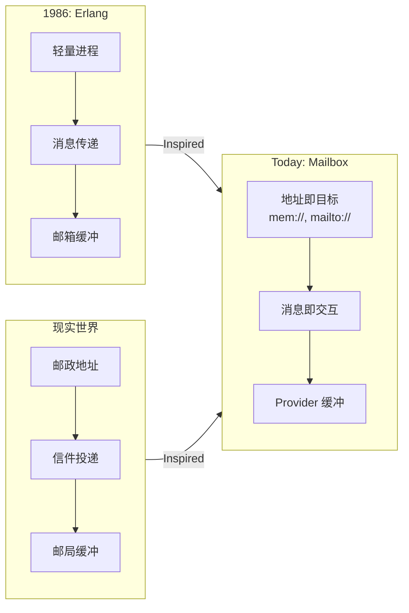

# 📮 Mailbox — 重新思考异步编程

> 轻量可插拔的“邮箱/队列”内核，把一切通信看作“给某个地址投递一封信”。一个地址代表一个唯一的邮箱，它可以通过不同的 Provider 适配的多种传输协议（如 `mem:`、`mailto:`、`slack:`）来访问。
> 用邮箱（Mailbox）进行异步通讯，构建容错、分布式、人机协同系统。

[](https://www.npmjs.com/package/@mboxlabs/mailbox)
[](LICENSE)

## 🌟 为什么 Mailbox？

| 传统方式 | Mailbox 方式 |
|----------|--------------|
| ❌ 共享状态 + 锁 | ✅ 独立邮箱 + 消息 |
| ❌ 回调地狱 | ✅ `async/await` 无缝衔接 |
| ❌ 人机协作复杂 | ✅ 人 = 一个邮箱地址 |
| ❌ 离线场景难处理 | ✅ 消息自动缓冲重试 |

### Erlang 灵感

> _🙏 致敬：Erlang 的 Actor 模型_
> _“在 1980 年代，当计算机还像房间一样大时，
> Erlang 的创造者们就提出了一个革命性思想：
> **每个进程有自己的邮箱，通过消息通信，崩溃不是失败而是设计的一部分**”_
> —— Joe Armstrong, Robert Virding, Mike Williams

Mailbox **深受 Erlang Actor 模型启发**，但我们做了关键演进：

| Erlang (1986) | Mailbox (Today) | 为什么重要 |
|---------------|-----------------|------------|
| `Pid ! Message` | `send({ to: 'protocol://address' })` | **地址即身份，协议即路由**：`address` 部分是邮箱的唯一 ID。`protocol`（例如 `mem`, `mailto`）决定路由方式。同一地址可通过不同协议访问。 |
| 进程内 FIFO 邮箱 | Provider 可插拔 | **传输无关**：内存/邮件/Wechat/Mastodon 无缝切换 |
| 同一节点内通信 | 跨网络、跨组织 | **真正分布式**：人类和机器平等参与 |

> 💡 **我们的定位**：
> **不是 Erlang 的 JavaScript 复刻，而是 Actor 思想的现代化表达** ——
> 用 TypeScript 的类型安全 + JavaScript 的生态活力，让“地址即目标”触手可及。

## 🚀 为什么 Mailbox 让人激动？

### 📮 我们解决了什么？

| 传统世界 | Mailbox 世界 |
|----------|--------------|
| ❌ “服务必须在线才能调用” | ✅ **投递即成功** —— 不关心对方状态 |
| ❌ “人类必须实时响应” | ✅ **人类 = 一个地址** —— 按自己节奏处理 |
| ❌ “跨组织协作需要 API 对接” | ✅ **电子邮件就是 API** —— 零集成成本 |
| ❌ “移动端离线 = 功能瘫痪” | ✅ **离线是常态** —— 消息自动缓冲等待 |

### 💡 灵感融合：Erlang 智慧 + 现实世界

> _“Erlang 教会我们：**消息传递是构建健壮系统的基石**
> 现实世界提醒我们：**邮政系统运转 500 年，因为它不假设收件人此刻在家门口等待！**”_

Mailbox 将二者结合：

- **Actor 的严谨**：每个目标独立邮箱，消息是唯一通信方式
- **邮政的包容**：地址统一标识，传输协议可插拔



## 📪 邮箱地址

邮箱地址（**MailAddress**）是整个系统的基石，作为任何目的地的唯一通用标识符。它遵循 [RFC 3986](https://tools.ietf.org/html/rfc3986) URI 规范。

- **格式**: `protocol:user@physical_address[/logical_address]`
- **示例**: `mailto:api@myservice.com/utils/greeter`

一个邮箱地址由三部分组成：

- **`protocol`（协议）**: 指定消息的**传输方式**（例如 `mailto` 代表通过邮件发送，`mem` 代表通过内存总线发送）。它告诉 `Mailbox` 应该由哪个提供者处理消息。
- **`user@physical_address`（物理邮箱地址）**: 这是逻辑邮箱或服务的**全球唯一、与协议无关的 ID**。同一个物理地址可以通过不同的协议访问（例如 `mem:api@myservice.com` 和 `mailto:api@myservice.com` 指向同一个逻辑实体）。
- **`/logical_address`（逻辑地址）** (可选): 一个可选的路径，可用于内部路由。例如，当与 `tool-rpc` 结合使用时，它可以将消息路由到更庞大服务中的特定工具，允许一个物理地址作为多个逻辑功能的统一网关。

## 🚀 快速开始

只需三步，即可体验 Mailbox 的核心魅力：

1. **安装**

   ```bash
   npm install @mboxlabs/mailbox
   ```

2. **编写代码**

   ```ts
   import { Mailbox, MemoryProvider } from '@mboxlabs/mailbox';

   // 1. 创建邮箱实例并注册一个内存提供者
   const mailbox = new Mailbox();
   mailbox.registerProvider(new MemoryProvider());

   // 2. 订阅一个地址，并定义如何处理消息
   const subscription = mailbox.subscribe('mem:service@example.com/inbox', message => {
     console.log(`收到消息！来自: ${message.from}`);
     console.log(`内容:`, message.body);
   });

   console.log("邮箱已建立，正在监听 'mem:service@example.com/inbox'...");

   // 3. 向该地址投递一封邮件
   await mailbox.post({
     from: 'mem:client@example.com/user-1',
     to: 'mem:service@example.com/inbox',
     body: { text: '你好，Mailbox！' },
   });

   // 清理
   await subscription.unsubscribe();
   ```

3. **运行**

   如果使用 `ts-node` 或类似工具运行上述代码，你将看到：

   ```sh
   邮箱已建立，正在监听 'mem:service@example.com/inbox'...
   收到消息！来自: mem:client@example.com/user-1
   内容: { text: '你好，Mailbox！' }
   ```

   这个例子展示了 Mailbox 的基本循环：**订阅地址 -> 投递消息 -> 接收处理**。地址 `mem:service@example.com/inbox` 告诉 Mailbox 使用 `mem`（内存）协议，将消息投递到物理地址 `service@example.com` 的逻辑路径 `/inbox` 下。这种格式使得路由清晰而灵活。

## 📦 生态系统

| 包 | 说明  |
|-----|------|
| [`@mboxlabs/mailbox`](https://github.com/mboxlabs/mailbox.js) | 核心邮箱系统 |
| [`@mboxlabs/mailbox-input`](https://github.com/mboxlabs/mailbox-input.js) | 输入提供者：人机输入交互抽象类 |
| [`@mboxlabs/mailbox-email`](https://github.com/mboxlabs/mailbox-email.js) | 邮箱提供者：电子邮件(SMTP, IMAP/POP3) |

## 📚 深入学习

- [Erlang 灵感详解](erlang-inspiration.md)
- [5 个真实场景示例](examples.md)
- [API 速查手册](docs/)

## 🤝 贡献指南

详见 [CONTRIBUTING.cn.md](CONTRIBUTING.cn.md) —— 我们欢迎所有贡献者！

> **记住**：在 Mailbox 的世界里，**每个邮箱都是一个独立宇宙，消息是穿越时空的信使** 🌌
