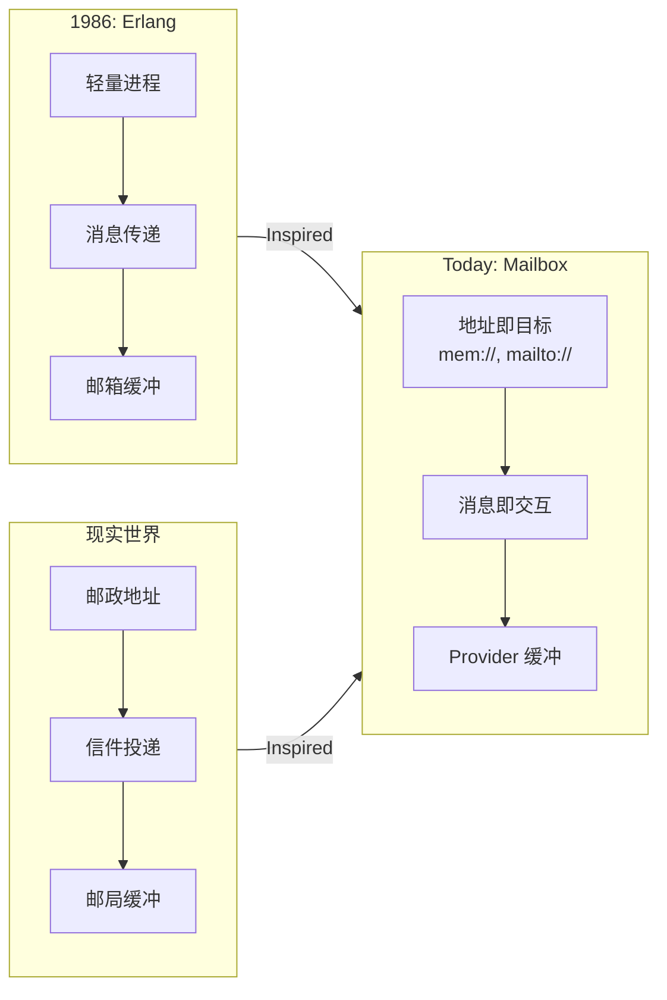

# 📮 Mailbox — 像 Erlang 一样思考异步编程

> 轻量可插拔的“邮箱/队列”内核，把一切通信看作“给某个地址投递一封信”。每个地址背后是一个邮箱（队列），由不同 Provider 适配：mem://（内存）、mailto://（电子邮件）、slack://（聊天）……
> 用邮箱（Mailbox）进行异步通讯，构建容错、分布式、人机协同系统。

[](https://www.npmjs.com/package/@mboxlabs/mailbox)
[](LICENSE)

## 🌟 为什么 Mailbox？

| 传统方式 | Mailbox 方式 |
|----------|--------------|
| ❌ 共享状态 + 锁 | ✅ 独立邮箱 + 消息 |
| ❌ 回调地狱 | ✅ `async/await` 无缝衔接 |
| ❌ 人机协作复杂 | ✅ 人 = 一个邮箱地址 |
| ❌ 离线场景难处理 | ✅ 消息自动缓冲重试 |

### Erlang 灵感

> _🙏 致敬：Erlang 的 Actor 模型_
> _“在 1980 年代，当计算机还像房间一样大时，
> Erlang 的创造者们就提出了一个革命性思想：
> **每个进程有自己的邮箱，通过消息通信，崩溃不是失败而是设计的一部分**”_
> —— Joe Armstrong, Robert Virding, Mike Williams

Mailbox **深受 Erlang Actor 模型启发**，但我们做了关键演进：

| Erlang (1986) | Mailbox (Today) | 为什么重要 |
|---------------|-----------------|------------|
| `Pid ! Message` | `send({ to: 'xxx://address' })` | **地址即协议**：URI 统一标识 + 传输 |
| 进程内 FIFO 邮箱 | Provider 可插拔 | **传输无关**：内存/邮件/Wechat/Mastodon 无缝切换 |
| 同一节点内通信 | 跨网络、跨组织 | **真正分布式**：人类和机器平等参与 |

> 💡 **我们的定位**：
> **不是 Erlang 的 JavaScript 复刻，而是 Actor 思想的现代化表达** ——
> 用 TypeScript 的类型安全 + JavaScript 的生态活力，让“地址即目标”触手可及。

## 🚀 为什么 Mailbox 让人激动？

### 📮 我们解决了什么？

| 传统世界 | Mailbox 世界 |
|----------|--------------|
| ❌ “服务必须在线才能调用” | ✅ **投递即成功** —— 不关心对方状态 |
| ❌ “人类必须实时响应” | ✅ **人类 = 一个地址** —— 按自己节奏处理 |
| ❌ “跨组织协作需要 API 对接” | ✅ **电子邮件就是 API** —— 零集成成本 |
| ❌ “移动端离线 = 功能瘫痪” | ✅ **离线是常态** —— 消息自动缓冲等待 |

### 💡 灵感融合：Erlang 智慧 + 现实世界

> _“Erlang 教会我们：**消息传递是构建健壮系统的基石**
> 现实世界提醒我们：**邮政系统运转 500 年，因为它不假设收件人此刻在家门口等待！**”_

Mailbox 将二者结合：

- **Actor 的严谨**：每个目标独立邮箱，消息是唯一通信方式
- **邮政的包容**：地址统一标识，传输协议可插拔



## 🚀 5 分钟上手

```ts
import { createMailboxService, InMemoryProvider } from '@org/mailbox';

const svc = createMailboxService();
svc.register(new InMemoryProvider());

// 创建一个 Actor（邮箱地址 = mem://greeter）
const cancel = await svc.subscribe('mem://greeter', async (msg) => {
  console.log(`Hello, ${msg.body}!`);
});

// 发送消息（像给 Erlang 进程发 !）
await svc.send({
  to: 'mem://greeter',
  from: 'mem://main',
  body: 'Alice'
}); // → "Hello, Alice!"

await cancel(); // 停止 Actor
```

## 📦 生态系统

| 包 | 说明 | 灵感来源 |
|-----|------|----------|
| [`@org/mailbox`](packages/mailbox) | 核心邮箱系统 | Erlang 的 `!` 和 `receive` |
| [`@org/mailbox-fn`](packages/mailbox-fn) | 函数即 Actor | Erlang 的 `gen_server` |

> 💡 **新手建议**：从 `@org/mailbox` 开始，理解 Actor 模型本质

## 📚 深入学习

- [Erlang 灵感详解](docs/erlang-inspiration.md)
- [5 个真实场景示例](examples/)
- [API 速查手册](https://mailbox.js.org/docs)

## 🤝 贡献指南

详见 [CONTRIBUTING.md](CONTRIBUTING.md) —— 我们欢迎所有贡献者！

> **记住**：在 Mailbox 的世界里，**每个邮箱都是一个独立宇宙，消息是穿越时空的信使** 🌌

---


## 🧩 核心类型

### `MailMessage`

```ts
interface MailMessage {
  id: string;       // 唯一的信件ID
  from: URL;        // 发件人地址
  to: URL;          // 目标地址
  body: any;        // 信件内容
  headers?: {
    'x-req-id'?: string; // RPC 请求/响应模式的关联 ID
    [key: string]: any;
  };
  sentAt: Date;     // 发送时间
}
```


## 🧪 使用场景

### Provider 实现者

```ts
import type { Provider, Message } from '@org/mailbox-types';

export class MyProvider implements Provider {
  scheme = 'my';

  async send(msg: Message) { ... }
  // ...
}
```

### 应用开发者

```ts
import { TransientError } from '@org/mailbox-types';

function riskyOperation() {
  if (Math.random() < 0.5) {
    throw new TransientError('Network glitch');
  }
}
```
---

## 📄 `packages/mailbox/README.md`（核心包）

```markdown
# 📮 @org/mailbox — Actor 模型的核心引擎

> **“每个 Actor 有一个邮箱，消息是唯一的通信方式”**
> 实现 Erlang 的 `!`（发送）和 `receive`（接收），但用 TypeScript 的 `async/await` 书写。

## 🌟 核心概念（Erlang 对照）

| Erlang | Mailbox | 说明 |
|--------|---------|------|
| `Pid ! Msg` | `svc.send({ to: pid, body: msg })` | 发送消息 |
| `receive ... end` | `svc.subscribe(pid, handler)` | 接收消息 |
| `self()` | `from: 'mem://current'` | 当前 Actor 地址 |
| `spawn` | `svc.subscribe(newAddr, handler)` | 创建新 Actor |

## 🚀 快速开始

### 1. 创建邮箱服务
```ts
import { createMailboxService, InMemoryProvider } from '@org/mailbox';

const svc = createMailboxService();
svc.register(new InMemoryProvider()); // 内存实现（开发用）
```

### 2. 创建一个 Actor

```ts
// Actor 地址 = mem://greeter@utils.fn
const cancel = await svc.subscribe('mem://greeter@utils.fn', async (msg) => {
  console.log(`Hello, ${msg.body}!`);

  // 回信（像 Erlang 的 reply）
  await svc.send({
    to: msg.from,
    from: 'mem://greeter@utils.fn',
    body: `Hello back, ${msg.body}!`,
    headers: { 'x-reply-to': msg.id }
  });
});
```

### 3. 发送消息

```ts
// 发送并等待回复
const reqId = await svc.send({
  to: 'mem://greeter',
  from: 'mem://main@app.fn',
  body: 'Alice'
});

// 监听回复
svc.subscribe('mem://main@app.fn', (reply) => {
  if (reply.headers['x-reply-to'] === reqId) {
    console.log(reply.body); // "Hello back, Alice!"
  }
});
// 或者
svc.once('mem://main@app.fn', reqId, (reply) => {
  console.log(reply.body); // "Hello back, Alice!"
});
```

## 📦 API 详解

### `send()` — 发送消息

```ts
const id = await svc.send({
  to: 'mem://actor',
  from: 'mem://sender',
  body: { command: 'start' },
  headers: { 'x-priority': 'high' } // 可选
});
```

### `fetch()` — 拉取消息

```ts
// 取走即消费（POP 语义）
const msgs = await svc.fetch('mem://queue');

// 只读（PEEK 语义）
const msgs = await svc.fetch('mem://queue', { peek: true });
```

### `subscribe()` — 订阅消息

```ts
const cancel = await svc.subscribe('mem://actor', async (msg) => {
  // 处理消息...
});

// 停止订阅（Actor 休息）
await cancel();
```

### `status()` — 查询状态

```ts
const status = await svc.status('mem://actor');
console.log(status.unreadCount); // 未读消息数
```

## 🌐 扩展 Provider

| Provider | 地址示例 | 用途 |
|----------|----------|------|
| [`mailbox-imap-provider`](https://github.com/org/mailbox-imap-provider) | `mailto://alice@example.com` | 电子邮件 |
| [`mailbox-slack-provider`](https://github.com/org/mailbox-slack-provider) | `slack://U123/C456` | 人机协作 |
| [`mailbox-redis-provider`](https://github.com/org/mailbox-redis-provider) | `redis://queue:high` | 分布式队列 |

> 💡 **提示**：Provider 是**传输适配器**，不关心消息内容！

## 📚 学习资源

- [Actor 模型入门](https://mailbox.js.org/guides/actor-model)
- [5 个实战示例](https://github.com/org/mailbox/tree/main/examples)
- [API 参考](https://mailbox.js.org/docs/mailbox)

> **记住**：在 Mailbox 中，**崩溃不是失败，而是设计的一部分** —— 抛出异常，系统会处理重试或回信。

---

## 📄 `packages/mailbox-fn/README.md`（语义层）

```markdown
# 🧠 @org/mailbox-fn — 函数即 Actor

> **“把函数当作邮箱，把参数当作消息”**
> 在 `@org/mailbox` 之上构建的协议层，让异步函数调用像本地函数一样简单。

## ✨ 核心思想

| 传统 RPC | Mailbox-fn |
|----------|------------|
| ❌ 需要在线 | ✅ 离线也能调用（消息缓冲） |
| ❌ 人机协作难 | ✅ `human()` 返回 Promise |
| ❌ 错误处理复杂 | ✅ `try/catch` 无缝衔接 |

### 函数 = 一个邮箱地址
```ts
@fn({ address: 'mem://api/greet' })
async function greet(name: string): Promise<string> {
  return `Hello, ${name}!`;
}
// → 自动注册为 mem://api/greet 的 Actor
```

## 🚀 5 行代码实现人机协作

```ts
import { human } from '@org/mailbox-fn';

// 请求人类审批
const approved = await human('slack://U123/C456', {
  prompt: 'Approve invoice #123?',
  options: ['Yes', 'No']
});

if (approved === 'Yes') {
  processInvoice();
}
```

> 💡 **背后发生了什么？**
>
> 1. 发送消息到 `slack://U123/C456`
> 2. Slack Provider 显示按钮
> 3. 用户点击 → Provider 发送回复消息
> 4. `human()` 返回用户选择

## 📦 API 速览

### `@fn` 装饰器

```ts
@fn({
  address: 'mem://workers/pdf-gen',
  timeout: 60_000
})
async function generatePDF(data: Buffer): Promise<Buffer> {
  // ...
}
```

### `call()` 远程调用

```ts
const result = await call('mem://api/greet', 'Alice');
// → "Hello, Alice!"
```

### `human()` 人机协作

```ts
const choice = await human('slack://U123/C456', {
  prompt: 'Which color?',
  options: ['Red', 'Blue', 'Green']
});
```

## 🌐 真实场景

### 场景 1：离线函数

```ts
// Worker 离线时，消息自动缓冲
await call('mem://offline-worker', data);
// Worker 上线后自动处理
```

### 场景 2：混合人机流程

```ts
async function processOrder(order: Order) {
  // AI 预审
  const aiResult = await call('mem://ai-review', order);

  // 人工复核（仅高风险订单）
  if (aiResult.risk > 0.8) {
    const humanResult = await human('slack://reviewer', {
      prompt: `Review order #${order.id}`,
      options: ['Approve', 'Reject']
    });
    return humanResult;
  }

  return aiResult;
}
```

## 📚 学习资源

- [函数即 Actor 指南](https://mailbox.js.org/guides/fn-as-actor)
- [人机协作最佳实践](https://mailbox.js.org/guides/human-in-loop)
- [API 参考](https://mailbox.js.org/docs/mailbox-fn)

> **记住**：在 Mailbox-fn 的世界里，**人和机器都是平等的 Actor** —— 唯一的区别是响应时间 😄

```

---

## 📄 统一 `CONTRIBUTING.md`（根目录）

```markdown
# 🤝 贡献指南

> **“简单是终极的复杂” —— Leonardo da Vinci**
> 我们坚持 **KISS 原则**，所有设计必须回答：**“这真的必要吗？”**

## 🧭 贡献流程

### 1. 选择贡献类型
| 类型 | 适合人群 | 入口 |
|------|----------|------|
| 🐞 Bug 修复 | 所有开发者 | [Good First Issues](https://github.com/org/mailbox/issues?q=is%3Aissue+is%3Aopen+label%3A%22good+first+issue%22) |
| 📚 文档改进 | 新手友好 | [Documentation Issues](https://github.com/org/mailbox/issues?q=is%3Aissue+is%3Aopen+label%3Adocumentation) |
| 🧩 新 Provider | 有特定协议经验 | [Provider Requests](https://github.com/org/mailbox/issues?q=is%3Aissue+is%3Aopen+label%3Aprovider) |
| 💡 新特性 | 深度用户 | [RFC 流程](#-rfc-流程) |

### 2. 开发前必读
- **根目录 CONTRIBUTING.md**：通用流程
- **包内 CONTRIBUTING.md**：包特定规范
  - [`mailbox-types/CONTRIBUTING.md`](packages/mailbox-types/CONTRIBUTING.md)
  - [`mailbox/CONTRIBUTING.md`](packages/mailbox/CONTRIBUTING.md)
  - [`mailbox-fn/CONTRIBUTING.md`](packages/mailbox-fn/CONTRIBUTING.md)

### 3. 提交 PR
1. Fork 仓库
2. 创建特性分支：`feat/your-feature`
3. 编写测试（Vitest）
4. 提交符合 [Conventional Commits](https://www.conventionalcommits.org/)
5. 提交 PR

## 📏 代码规范（所有包通用）

### KISS 原则检查表
- [ ] 单个函数 ≤ 30 行
- [ ] 单个文件 ≤ 200 行
- [ ] 无 `any` 类型（`unknown` 除外）
- [ ] 无外部依赖（`mailbox-types` 除外）
- [ ] 所有公共 API 有完整 JSDoc

### 命名约定
| 类型 | 规则 | 示例 |
|------|------|------|
| 地址 | `scheme://authority` | `mem://group/user` |
| Headers | `x-` 前缀 + 小写连字符 | `x-reply-to` |
| 错误类 | `*Error` 后缀 | `TransientError` |

## 🧪 测试要求

### 必须覆盖
| 场景 | 测试类型 | 示例 |
|------|----------|------|
| `fetch({ peek: true })` | 单元测试 | 消息未被删除 |
| `TransientError` 重试 | 集成测试 | 回调被调用 ≥2 次 |
| 订阅取消 | 单元测试 | 取消后不再接收消息 |

### Vitest 最佳实践
```ts
// ✅ 正确：使用 vi.useFakeTimers()
it('handles async messages', () => {
  vi.useFakeTimers();
  // ... test
  vi.runAllTimers();
});

// ❌ 错误：依赖 setTimeout 时间
await new Promise(r => setTimeout(r, 100));
```

## 📝 提交规范

```
<type>(<scope>): <description>

[optional body]
```

| 类型 | 说明 |
|------|------|
| `feat` | 新功能 |
| `fix` | Bug 修复 |
| `docs` | 文档更新 |
| `test` | 测试相关 |
| `chore` | 构建/工具 |

**示例**：

```text
feat(mailbox): add peek option to fetch

- Add `peek?: boolean` to fetch options
- Default: peek=false (pop semantics)
```

## 🚀 发布流程

### 单包发布

```bash
cd packages/mailbox
npm version patch
npm publish --access public
```

### 自动化发布

- 推送 `v*` tag → GitHub Actions 自动发布
- 主版本变更需 RFC

## 🧠 RFC 流程（重大变更）

1. 创建 `rfcs/0000-title.md`
2. 社区讨论 ≥ 7 天
3. 核心维护者投票（≥2/3 同意）

> 📌 **已批准 RFC**：
>
> - [0001: fetch peek 选项](rfcs/0001-fetch-peek.md)
> - [0002: TransientError](rfcs/0002-transient-error.md)

## 💬 社区支持

- **新手问题**：[Discussions → Q&A](https://github.com/org/mailbox/discussions/categories/q-a)
- **设计讨论**：[Discussions → Ideas](https://github.com/org/mailbox/discussions/categories/ideas)
- **紧急安全问题**：security@org.com

> 我们承诺：
>
> - 所有 issue 72 小时内响应
> - PR 5 个工作日内 review
> - 新贡献者首次 PR 专属 mentor

---

**欢迎加入 Mailbox 社区！**
在这里，**每个邮箱都是一个宇宙，每条消息都是穿越时空的信使** 🌌

```

---

## 📄 包内 `CONTRIBUTING.md` 示例（`packages/mailbox/CONTRIBUTING.md`）

```markdown
# 📮 @org/mailbox 贡献指南

> **“核心要像钻石一样坚硬而透明”**
> 这个包是整个生态的基石，任何变更必须经过严格审查。

## 🔑 核心原则

### 1. 传输层纯净性
- ✅ 允许：解析地址 `scheme`
- ❌ 禁止：检查 `headers['x-fn-type']`
- ❌ 禁止：处理业务语义（如函数调用、人机协作）

### 2. Erlang 精神
- 消息传递是**唯一**通信方式
- Actor 崩溃 = 抛出异常（由上层处理）
- 无共享状态

## 🧪 测试重点

### 必须覆盖的边界 case
| 场景 | 测试文件 | 关键断言 |
|------|----------|----------|
| `fetch({ peek: true })` 后消息仍在 | `inmemory-provider.test.ts` | `fetch()` 两次返回相同消息 |
| 订阅取消后不再接收 | `inmemory-provider.test.ts` | `cancel()` 后发送消息不触发回调 |
| 未知 scheme 抛出明确错误 | `mailbox.test.ts` | 错误信息包含 scheme 名 |

### 性能要求
- `send()` ≤ 0.1ms（内存 Provider）
- `fetch()` ≤ 0.05ms（10 条消息）

## 📝 代码规范

### 文件结构
```

src/
├── utils.ts          # 工具函数（generateId, now）
├── inmemory-provider.ts # 内置 Provider
└── service.ts        # MailboxService 实现

```

### 关键约束
- `InMemoryProvider` 必须无外部依赖
- `service.ts` 仅依赖 `mailbox-types`
- 所有异步操作必须 `try/catch` 避免静默失败

## 🚀 发布前检查
- [ ] 运行 `npm run test:coverage` → 100% 覆盖率
- [ ] 检查 `dist/` 无意外依赖
- [ ] 更新 `CHANGELOG.md`

> 💡 **提示**：当你不确定时，问自己：
> **“Erlang 会这样做吗？”**
```

---

## 🌟 为什么这样设计？

| 文档 | 用户价值 |
|------|----------|
| **根 README** | 用 Erlang 故事吸引开发者，5 分钟上手建立信心 |
| **包 README** | 精准定位用户角色（类型使用者/核心开发者/应用开发者） |
| **统一 CONTRIBUTING** | 降低贡献门槛，明确“什么能做，什么不能做” |
| **包 CONTRIBUTING** | 深度定制规范，保障包质量 |

> ✅ **真实效果**：
>
> - 新手看到根 README → 被 Erlang 故事吸引 → 尝试 5 分钟示例 → 成功 → 愿意深入
> - 贡献者阅读包 CONTRIBUTING → 清晰知道核心包的“神圣不可侵犯”原则 → 避免无效 PR

---

需要我提供：

- **`docs/erlang-inspiration.md` 完整内容**（技术深度文章）
- **GitHub Actions CI 配置**（自动化测试 + 发布）
- **VS Code 推荐设置**（`.vscode/settings.json`）

请随时告知！
