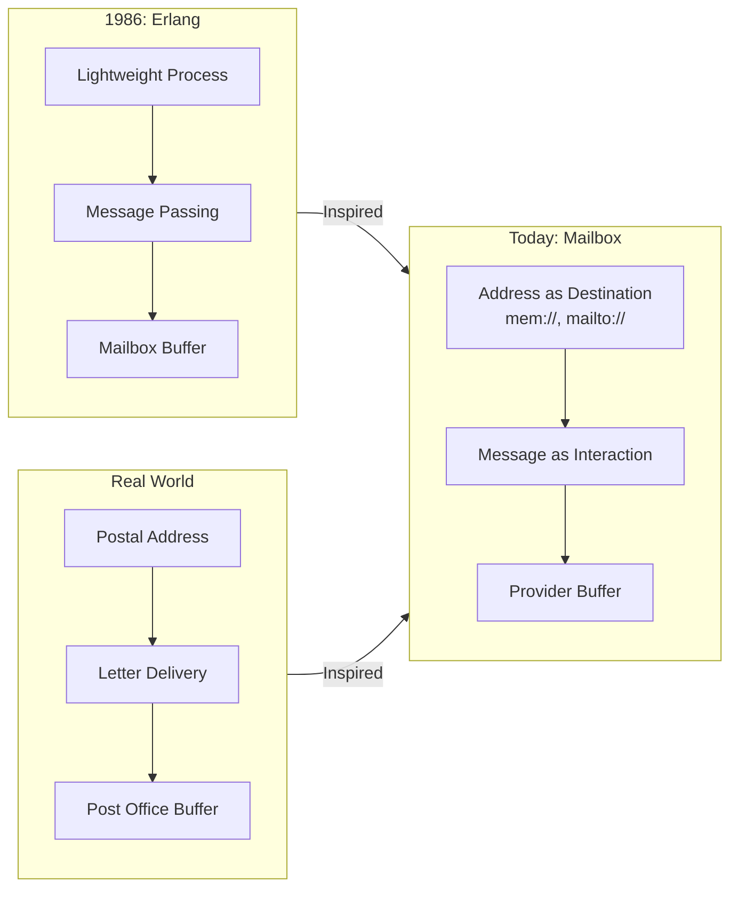

# 📮 Mailbox — Rethinking Asynchronous Programming

> A lightweight, pluggable "mailbox/queue" kernel that treats all communication as "delivering a letter to an address." Behind each address is a mailbox (queue), adapted by different Providers: mem:// (memory), mailto:// (email), slack:// (chat)...
> Use Mailbox for asynchronous communication to build fault-tolerant, distributed, human-computer collaborative systems.

[](https://www.npmjs.com/package/@mboxlabs/mailbox)
[](LICENSE-MIT)

## 🌟 Why Mailbox?

| Traditional Way | Mailbox Way |
|---|---|
| ❌ Shared State + Locks | ✅ Isolated Mailboxes + Messages |
| ❌ Callback Hell | ✅ Seamless `async/await` Integration |
| ❌ Complex Human-Machine Collaboration | ✅ Human = A Mailbox Address |
| ❌ Difficult Offline Scenarios | ✅ Automatic Message Buffering & Retry |

### Erlang Inspiration

> _🙏 A tribute to Erlang's Actor Model_
> _"When computers were the size of rooms,
> the creators of Erlang proposed a revolutionary idea:
> **Each process has its own mailbox, communicates via messages, and crashing is not a failure but part of the design.**"_
> — Joe Armstrong, Robert Virding, Mike Williams

Mailbox is **deeply inspired by the Erlang Actor Model**, but we've made key evolutions:

| Erlang (1986) | Mailbox (Today) | Why It Matters |
|---|---|---|
| `Pid ! Message` | `send({ to: 'xxx://address' })` | **Address is Protocol**: URI for unified identity + transport |
| In-process FIFO Mailbox | Pluggable Providers | **Transport Agnostic**: Seamlessly switch between memory/email/WeChat/Mastodon |
| Intra-node Communication | Cross-network, Cross-organization | **Truly Distributed**: Humans and machines participate as equals |

> 💡 **Our Position**:
> **Not a JavaScript clone of Erlang, but a modern expression of the Actor philosophy** —
> Using TypeScript's type safety + JavaScript's ecosystem vitality to make "address as the destination" a reality.

## 🚀 Why is Mailbox Exciting?

### 📮 What Problems Do We Solve?

| Traditional World | Mailbox World |
|---|---|
| ❌ "Service must be online to be called" | ✅ **Delivery is Success** — Don't care about the recipient's state |
| ❌ "Humans must respond in real-time" | ✅ **Human = An Address** — Process at your own pace |
| ❌ "Cross-org collaboration requires API integration" | ✅ **Email is the API** — Zero integration cost |
| ❌ "Offline mobile app = Paralyzed functionality" | ✅ **Offline is the Norm** — Messages are automatically buffered |

### 💡 Fusing Inspirations: Erlang's Wisdom + The Real World

> _"Erlang taught us: **Message passing is the cornerstone of robust systems.**
> The real world reminds us: **The postal system has worked for 500 years because it doesn't assume the recipient is waiting at the door!**"_

Mailbox combines the two:

- **Actor's Rigor**: Each destination has an independent mailbox; messages are the only way to communicate.
- **Postal System's Inclusivity**: Unified addresses, pluggable transport protocols.



## 🚀 Quick Start

Get a taste of Mailbox's core power in just three steps:

1. **Installation**

    ```bash
    npm install @mboxlabs/mailbox
    ```

2. **Write Code**

    ```ts
    import { Mailbox, MemoryProvider } from '@mboxlabs/mailbox';

    // 1. Create a Mailbox instance and register a memory provider
    const mailbox = new Mailbox();
    mailbox.registerProvider(new MemoryProvider());

    // 2. Subscribe to an address and define how to handle messages
    const subscription = mailbox.subscribe('mem://service/inbox', message => {
      console.log(`Message received! From: ${message.from}`);
      console.log(`Body:`, message.body);
    });

    console.log("Mailbox is set up, listening on 'mem://service/inbox'...");

    // 3. Post a mail to that address
    await mailbox.post({
      from: 'mem://client/user-1',
      to: 'mem://service/inbox',
      body: { text: 'Hello, Mailbox!' },
    });

    // Clean up
    await subscription.unsubscribe();
    ```

3. **Run It**

If you run the code above using `ts-node` or a similar tool, you'll see:

```sh
Mailbox is set up, listening on 'mem://service/inbox'...
Message received! From: mem://client/user-1
Body: { text: 'Hello, Mailbox!' }
```

This example demonstrates the basic loop of Mailbox: **Subscribe to an address -> Post a message -> Receive and process**. The `mem://` protocol signifies that this is an in-memory message, perfect for getting started and for tests.

## 📦 Ecosystem

| Package | Description |
|---|---|
| [`@mboxlabs/mailbox`](https://github.com/mboxlabs/mailbox.js) | The core mailbox system |
| [`@mboxlabs/mailbox-input`](https://github.com/mboxlabs/mailbox-input.js) | Input Provider: An abstract class for human-computer interaction |
| [`@mboxlabs/mailbox-email`](https://github.com/mboxlabs/mailbox-email.js) | Mailbox Provider: Email (SMTP, IMAP/POP3) |

## 📚 Learn More

- [Erlang Inspiration Deep Dive](erlang-inspiration.md)
- [5 Real-world Scenario Examples](examples.md)
- [API Reference](docs/)

## 🤝 Contributing

See [CONTRIBUTING.md](CONTRIBUTING.md) — we welcome all contributors!

> **Remember**: In the world of Mailbox, **every mailbox is an independent universe, and messages are the couriers that travel through spacetime** 🌌
